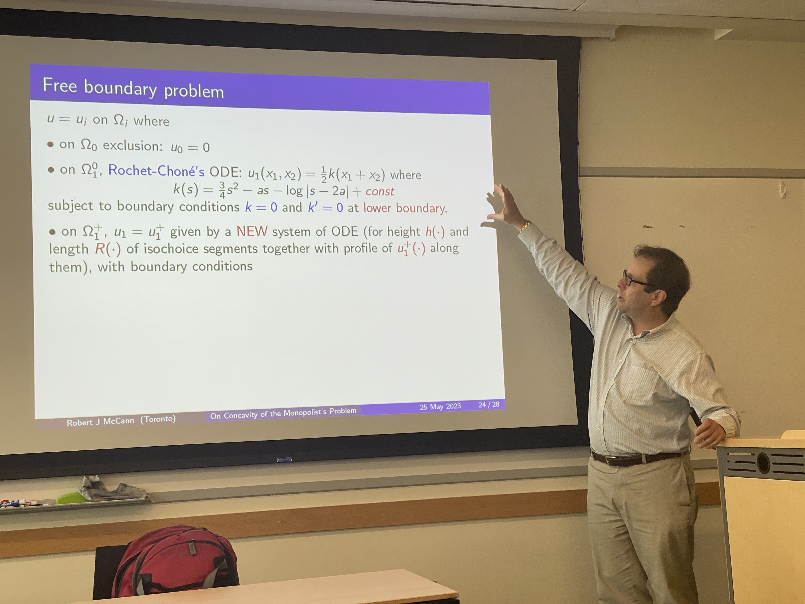

## Organizers
  * Zaid Harchaoui
  * Soumik Pal

## Schedule
  * **10:00  - 11:00**: Robert McCann (University of Toronto) 
  * **11:15 - 12:15**: Nabarun Deb (UBC+KI) via Zoom.
  * **12:30 - 14:00**: _Lunch_
  * **14:00 - 14:40**: Gaoqian Xu (UW Econ) - Student presentation
  * **14:50 - 15:50**: Stefan Steinerberger (UW math)
  * **16:00 - 16:40**: Raghav Somani (UW CS) and Raghav Tripathi (UW math) - Student presentation

## Photos

 ## Abstracts
 
 
The principal-agent problem is an important paradigm in economic theory
for studying the value of private information;  the nonlinear pricing problem
faced by a monopolist is one example; others include optimal taxation and auction design.
For multidimensional spaces of consumers (i.e. agents) and products, Rochet and Choné (1998)   
reformulated this problem to a concave maximization over the set of convex functions,
by assuming agent preferences combine bilinearity in the product and agent parameters with a (quasi)linear sensitivity to prices.
We characterize solutions to this problem by identifying a dual minimization problem.  This duality allows us to reduce
the solution of the square example of Rochet-Choné to a novel free boundary problem,  giving the first analytical description
of an overlooked market segment.  

[Based on work with KS Zhang (University of Waterloo)] 



In this talk, we study the sequence of marginals obtained from iterations of the Sinkhorn or IPFP algorithm and show that under a suitable time and regularization scaling, the marginals converge to an absolutely continuous curve on the Wasserstein space. The limit is an example of a new family of Wasserstein gradient flows, which we call the Wasserstein mirror flow, a construction inspired from Euclidean mirror flows. We provide examples to show that these flows can have faster convergence rates than usual gradient flows. We also construct a Mckean-Vlasov SDE whose marginal distributions give rise to the same flow. Overall this results in a wide generalization of Langevin diffusions and Fokker-Planck PDEs.
 
[Based on work with Young-Heon Kim (UBC), Soumik Pal (UW), Geoff Schiebinger (UBC)] 


 
This paper studies distributional model risk in relaxed marginal problems, where each marginal measure is assumed to lie in a Wasserstein ball of a given radius and centered at a fixed marginal reference measure. Theoretically, we establish strong duality, continuity, and finiteness of the proposed distributional model risk function (of radius), as well as the existence of an optimizer for each radius. Practically, we illustrate our results on four distinct applications when the sample information comes from multiple data sources and only marginal reference measures are identified. They are: partial identification of treatment effects; externally valid treatment choice via robust welfare functions; Wasserstein distributionally robust estimation under data combination; and evaluation of the worst aggregate risk measures.  

[Based on work with Yanqin Fan (UW) and Hyeonseok Park (UW)] 


 
We will discuss ways of defining a notion of curvature on combinatorial
graphs.  One of the classical and most canonical ways of doing it is the Ollivier 
curvature that defines curvature via Optimal Transport.  I will discuss some more 
recent ideas and a very simple notion that is extremely easy to compute (one 
linear system of equations) and has many of the same properties. 

[Partially joint work with Andrea Ottolini (UW) and Karel Devriendt (Oxford)] 


 
Optimizing functions over (unlabeled) graphs present an interesting and naturally occurring problem in many applications. These optimization problems can be usefully translated into optimizations on graphons as the size of the graphs increases. This enables us to employ more analytical tools, like gradient flows, to study these problems. Similar problems for interacting particle systems are known to converge to gradient flows in Wasserstein space. We develop an analogous theory for gradient flows on graphons, in which the edges of the graph behave as 'particles'. We demonstrate that a wide variety of optimization algorithms produce a deterministic curve on the space of graphons. This can be described by an infinite exchangeable array, whose coordinates are independent McKean-Vlasov type SDEs. In particular, we'll consider paths of a Metropolis-Hastings sampling algorithm on such graphs. This algorithm gives rise to the McKean-Vlasov system in the limit. Specifically, we'll show that, in the asymptotically zero noise case, the system converges exponentially fast towards the minimizer of the Gibbs potential.




